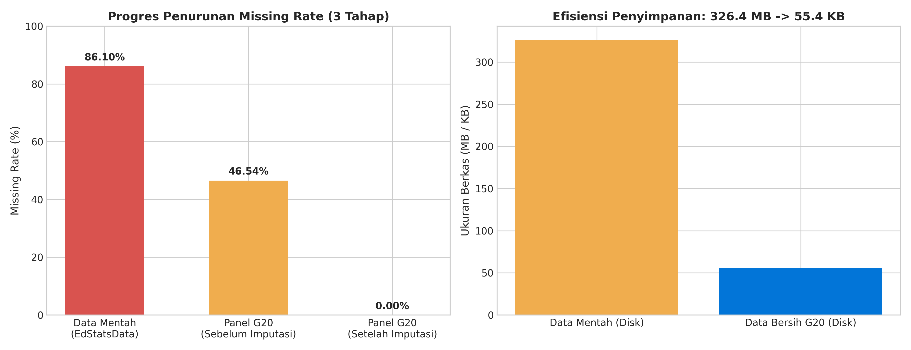
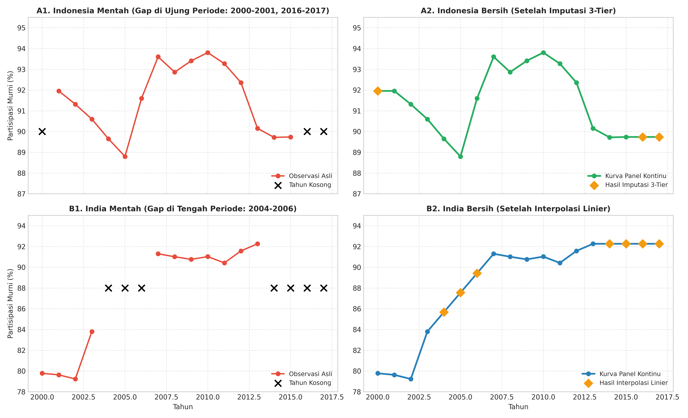
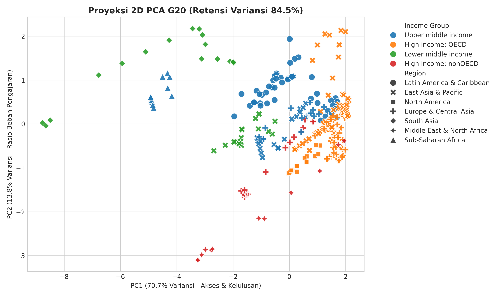
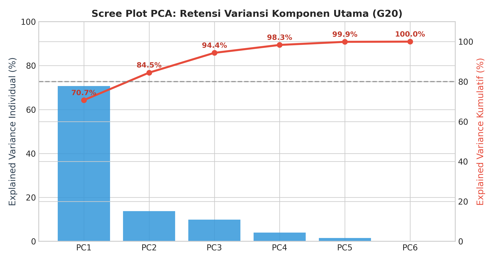
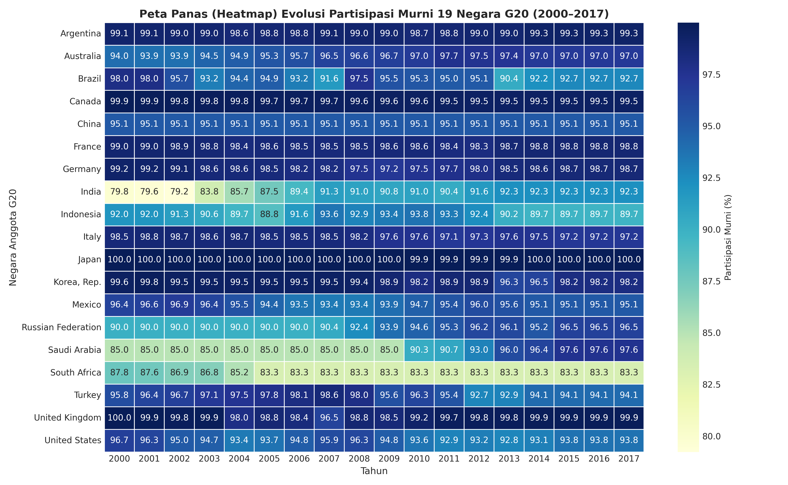
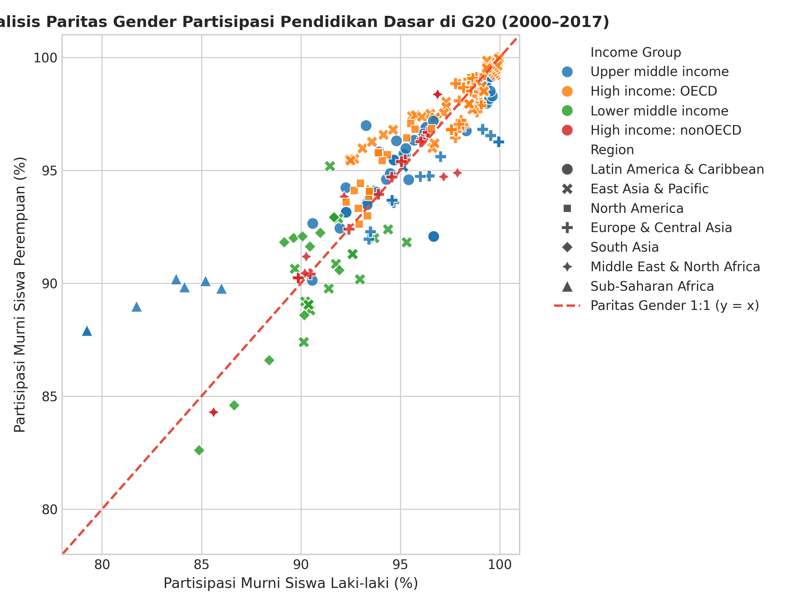

# 📊 G20 Education Statistics: End-to-End Data Preprocessing Pipeline

[](https://www.python.org/)
[](https://pandas.pydata.org/)
[](https://scikit-learn.org/)
[](LICENSE)

An end-to-end **Data Preprocessing & Data Engineering Pipeline** on the **World Bank Global Education Statistics (EdStats)** dataset, focusing on **Primary Education (*UNESCO ISCED Level 1*)** across **19 Sovereign Member Countries of the G20 (2000–2017)**.

---

## 📌 Project Overview

The raw World Bank EdStats dataset contains **886,930 rows and 70 columns (~326.4 MB)** with an extreme missingness rate of **86.10%** and unstandardized wide formats across 5 separate CSV files.

This project implements a standardized 7-step data preprocessing pipeline:
1. **Multi-Source Star Schema Integration:** Connecting fact tables with dimension entities, taxonomies, and survey methodology logs while resolving key mismatches and `YR2000` string format conflicts.
2. **Multi-Dimensional Reduction:** Filtering 19 G20 countries, 2000–2017 continuous time series, and 6 core Primary Education indicators.
3. **Domain-Specific Net Enrolment Focus:** Adopting *Net Enrolment Rate (NER)* with equal numerator and denominator cohort ages (7–12 years) to ensure natural $0\% - 100\%$ scale.
4. **Hierarchical 3-Tier Imputation:** Resolving 46.54% panel missingness to **0.00%** using temporal linear interpolation, peer income group median, and global G20 median fallback.
5. **Dimensionality Reduction (PCA):** Reducing 6 indicators to 2 Principal Components while retaining **84.47% cumulative variance**.
6. **Concept Hierarchy Discretization:** Binning completion rates and pupil-teacher ratios for categorical policy analysis.
7. **Comprehensive Benchmarking:** Evaluating global educational convergence and Indonesia's performance in the G20.

---

## 🛠️ The 7-Step Preprocessing Pipeline

```
[Raw 5 CSV Files] 
       │
       ▼ (Step 1: Load & Initial Profiling)
[Star Schema Multi-Table Integration]
       │
       ▼ (Step 2 & 3: Temporal, Geo, & Feature Reduction + Regex Cleaning)
[Filtered Longitudinal Panel (342 Rows x 6 Indicators)]
       │
       ▼ (Step 4: Unpivot/Pivot Tidy Panel + 3-Tier Imputation)
[Cleaned Panel Matrix (0.00% Missing Values)]
       │
       ▼ (Step 5: Z-Score Normalization + PCA Extraction)
[2D Orthogonal Space (84.47% Variance Retention)]
       │
       ▼ (Step 6: Categorical Discretization & Binning)
[ML-Ready Panel Dataset + Visual Analytics]
```

---

## 📈 Key Results & Visualizations

### 1. Before vs. After Preprocessing Evaluation
The pipeline reduced missingness from **86.10% to 0.00%** and reduced file size from **326.4 MB to 45.8 KB** (>99.9% storage & memory efficiency).

| Parameter / Quality Indicator | Global Raw Data (`EdStatsData`) | Raw G20 Panel (3D Filter) | Cleaned G20 Panel (`Cleaned`) | Methodological Note |
| :--- | :---: | :---: | :---: | :--- |
| **Table Structure** | Wide Format (70 Cols) | Tidy Panel Format (342 Rows) | Tidy Panel ML Ready | Structured (*Country-Year*) |
| **Number of Source Files** | 5 Separate Files | Integrated 5 Files | Integrated (*Star Schema*) | Resolved `YR2000` $\to$ `2000` |
| **Row Cardinality** | 886,930 rows | 342 panel rows | 342 complete panel rows | 19 G20 Countries (2000–2017) |
| **Feature Count** | 70 raw columns | 6 core indicators | 13 features (+ 2 PC & 2 Bins) | 84.47% PCA variance retention |
| **Enrolment Range** | >100% on GER | 79.23% – 100.00% (NER) | 79.23% – 100.00% (NER) | Consistent cohort age (7-12) |
| **Missing Cell Rate** | **86.10%** (*Sparse*) | **46.54%** (*Survey Gap*) | **0.00%** (*Fully Clean*) | 3-Tier Imputation success |
| **Disk Storage** | ~326.4 MB | ~55.4 KB | **~45.8 KB** | **>99.9% storage savings** |
| **RAM Allocation** | ~740.56 MB | ~0.05 MB | **~0.04 MB** | Optimal compute efficiency |



---

### 2. Time-Series Reconstruction Case Studies (Indonesia & India)
- **Indonesia (Boundary Gap):** Smoothly imputes missing census surveys at the start (2000–2001) and end (2016–2017) following national trends.
- **India (Middle Gap):** Linear interpolation reconstructs missing observations between 2004 and 2006 without altering acceleration dynamics.



---

### 3. Dimensionality Reduction (PCA Scree Plot & 2D Projection)
- **PC1 (70.71% Variance):** Primary Access & Completion Dimension.
- **PC2 (13.76% Variance):** Teacher Teaching Load Ratio Dimension.
- **Total Variance Explained:** **84.47%** (exceeding standard 80% threshold).




---

### 4. Longitudinal Macro Heatmap & Gender Parity
- **Macro Evolution (2000–2017):** Clear global convergence where emerging G20 nations accelerated towards universal primary completion (>95%).
- **Gender Parity:** Observations tightly adhere to the 1:1 diagonal line ($y=x$), proving full gender parity in primary school access across all G20 members.




---

## 📁 Repository Structure

```
├── .gitignore                                 # Git ignore rules (raw CSVs, caches, temp files)
├── README.md                                  # Repository overview and documentation
├── preprocessing_edstats.ipynb                # Fully executed Jupyter Notebook with outputs
├── build_notebook.py                          # Automated script to generate clean notebook
├── convert_to_docx.py                         # Academic report DOCX compiler
├── build_presentation.py                      # Presentation deck compiler
├── laporan.md                                 # Full 9-chapter academic report in Markdown
├── Laporan_Prapemrosesan_EdStats.docx          # Compiled Word report with embedded figures
├── EdStats_Cleaned_G20_2000_2017.csv          # Cleaned ML-ready panel dataset (342 rows)
│
└── figures/                                   # 300 DPI visualization artifacts
    ├── before_after_comparison.png
    ├── before_after_imputation_case_study.png
    ├── boxplot_outlier_detection.png
    ├── correlation_heatmap.png
    ├── gender_parity_analysis.png
    ├── pca_2d_projection.png
    ├── pca_scree_plot.png
    ├── temporal_heatmap_g20.png
    └── visualisasi_tren_pendidikan_g20.png
```

---

## 🚀 How to Run & Reproduce

1. **Clone the repository:**
   ```bash
   git clone https://github.com/AfiqMir/G20-Education-Stats.git
   cd G20-Education-Stats
   ```

2. **Download Raw Data:**
   - Download the World Bank EdStats dataset from [Kaggle](https://www.kaggle.com/datasets/theworldbank/education-statistics) or [World Bank Data Catalog](https://datacatalog.worldbank.org/search/dataset/0038480/Education-Statistics).
   - Extract the 5 CSV files into the folder: `./edstats-csv-zip-32-mb-/`.

3. **Execute Preprocessing Pipeline:**
   ```bash
   # Run notebook directly or via jupyter
   jupyter nbconvert --to notebook --execute preprocessing_edstats.ipynb
   ```

4. **Compile Report & Presentations (Optional):**
   ```bash
   python convert_to_docx.py
   python build_presentation.py
   ```

---

## 📊 Dataset Citations & Open Data Sources
- **World Bank EdStats:** [World Bank Official Education Statistics Data Catalog](https://datacatalog.worldbank.org/search/dataset/0038480/Education-Statistics)
- **UNESCO Institute for Statistics (UIS):** [UNESCO UIS Data Centre](http://data.uis.unesco.org/)
- **Kaggle Open Dataset:** [Kaggle - World Bank Education Statistics](https://www.kaggle.com/datasets/theworldbank/education-statistics)

---

## 📜 License
This project is open-sourced under the [MIT License](LICENSE).
